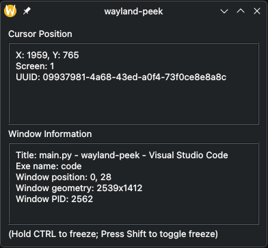

<h1>Wayland Peek</h1>

---

If you've used automation scripts on windows with [AutoHotKey](https://www.autohotkey.com/) you might be aware of the tool they bundle called "Window Spy", which is very handy in getting information about the window below the cursor + coordiantes on your screen. Problem is, there isn't any good alternative for Linux. There is [kdotool](https://github.com/jinliu/kdotool) but it's a CLI tool, so as a wise person once said *"If you don't like it, do it yourself"*, and that's how we got here.

Also I higly reccomend [ydotool](https://github.com/ReimuNotMoe/ydotool) for any input automation. 

## Backend rework in progress

Currently, I am not able to compile the script to an executable or appimage because of **pynput**. I am working on a rework to use **evdev** instead, but I can't figure out how it fully works out yet.

## Peformance

The performance is not great from a memory point of view, but that's because I am using Python instead of anything low level. I am planning on rewriting the app to either C, C++ or Rust for this, I mean the tool is only for Linux, so I don't really need the cross-platformability of Python. 
 

| CPU Usage | RAM Usage |
| - | - |
| ~0.1% | ~73Mb |

